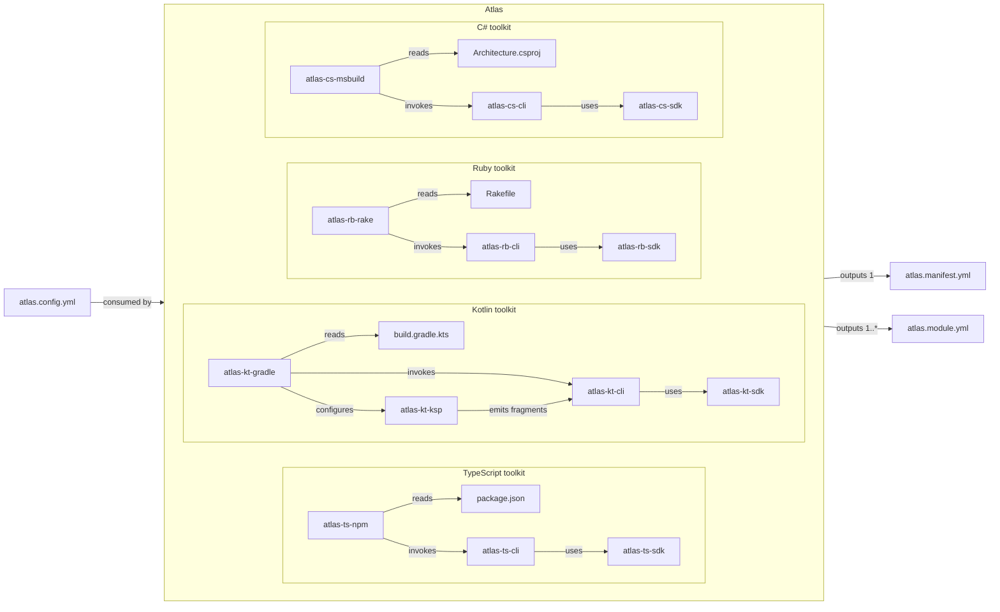
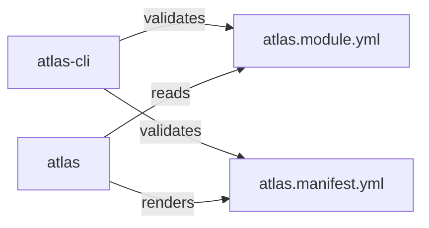

## Proposed Directory Structure

This tree inventories source units and significant build files only. Supporting
configuration, documentation, cache directories, and auxiliary build artifacts
are intentionally outside its scope.

```text
.
├── examples                                   | Runnable reference workspaces that demonstrate Atlas in each supported ecosystem.
│   ├── kotlin                                 | Gradle-based Kotlin clean-architecture example.
│   │   ├── atlas.config.yml                   | Atlas config file for the Kotlin example project.
│   │   ├── build.gradle.kts                   | Root build and Atlas-command entry point for the complete example.
│   │   ├── settings.gradle.kts                | Gradle project composition and module inclusion settings.
│   │   ├── app                                | Executable application module.
│   │   │   └── build.gradle.kts               | Module build definition and executable configuration.
│   │   └── lib                                | Library module.
│   │       └── build.gradle.kts               | Module build definition and library configuration.
│   ├── csharp                                 | C# clean-architecture example with MSBuild orchestration.
│   │   ├── atlas.config.yml                   | Atlas config file for the C# example project.
│   │   ├── Atlas.Example.slnx                 | Root solution that builds every C# project in the example.
│   │   ├── build                              | Container for the designated Atlas orchestration project.
│   │   │   └── Atlas.Example.csproj           | MSBuild project that owns Atlas targets and commands.
│   │   └── src                                | Container for executable and library project modules.
│   │       ├── app                            | Executable application module.
│   │       │   └── App.csproj                 | Executable project definition.
│   │       └── lib                            | Library module.
│   │           └── Lib.csproj                 | Library project definition.
│   ├── ruby                                   | Ruby multi-gem clean-architecture example.
│   │   ├── atlas.config.yml                   | Atlas config file for the Ruby example project.
│   │   ├── Rakefile                           | Root build and Atlas-command entry point for the complete example.
│   │   ├── Gemfile                            | Bundler dependency manifest for the example workspace.
│   │   └── gems                               | Container for independently packaged Ruby modules.
│   │       ├── lib                            | Library module.
│   │       │   └── atlas-example-lib.gemspec  | Library gem package definition.
│   │       └── app                            | Executable application module.
│   │           └── atlas-example-app.gemspec  | Executable gem package definition.
│   └── typescript                             | npm-workspace TypeScript clean-architecture example.
│       ├── atlas.config.yml                   | Atlas config file for the Typescript example project.
│       ├── package.json                       | Root build and Atlas-command entry point for the complete example.
│       └── packages                           | Container for independently packaged TypeScript modules.
│           ├── app                            | Executable application module.
│           │   └── package.json               | Executable package manifest and module build configuration.
│           └── lib                            | Library module.
│               └── package.json               | Library package manifest and module build configuration.
├── src                                        | Source for the Atlas toolkit.
│   ├── atlas-cli                              | The language-neutral CLI that enforces rules and produces viewer artifacts.
│   │   └── package.json                       | Node package manifest, build scripts, binary entry point, and schema exports.
│   ├── atlas                                  | The desktop application that hosts the generated interactive Atlas viewer.
│   │   └── package.json                       | Electron package manifest, build scripts, and desktop binary entry point.
│   └── tools                                  | Language-specific generators and build-tool integrations.
│       ├── cs                                 | C# tools.
│       │   ├── atlas-cs.slnx                  | Root solution that builds all C# tool projects together.
│       │   ├── atlas-cs-sdk                   | Pure Roslyn-backed C# model-generation library.
│       │   │   └── Atlas.Cs.Sdk.csproj        | Library project definition and NuGet package metadata.
│       │   ├── atlas-cs-cli                   | Command-line application that generates C# Atlas model files through the SDK.
│       │   │   └── Atlas.Cs.Cli.csproj        | .NET tool project definition and CLI packaging metadata.
│       │   └── atlas-cs-msbuild               | MSBuild targets that load the SDK or invoke the CLI and run Atlas targets.
│       │       └── Atlas.Cs.MSBuild.csproj    | NuGet package definition for imported MSBuild targets.
│       ├── kt                                 | Kotlin tools.
│       │   ├── settings.gradle.kts            | Gradle project composition and subproject inclusion settings.
│       │   ├── build.gradle.kts               | Root Gradle build, shared configuration, and tool verification tasks.
│       │   ├── atlas-kt-sdk                   | Pure Kotlin source-model generation library.
│       │   │   └── build.gradle.kts           | SDK module build definition and library publication metadata.
│       │   ├── atlas-kt-cli                   | Command-line application that generates Kotlin Atlas model files through the SDK.
│       │   │   └── build.gradle.kts           | CLI module build definition and application packaging metadata.
│       │   ├── atlas-kt-ksp                   | KSP processor that emits compiler-resolved semantic fragments.
│       │   │   └── build.gradle.kts           | KSP processor module build definition and publication metadata.
│       │   └── atlas-kt-gradle                | Gradle plugin that loads the SDK or invokes the CLI and provides Atlas tasks.
│       │       └── build.gradle.kts           | Gradle-plugin module build definition and plugin publication metadata.
│       ├── rb                                 | Ruby tools.
│       │   ├── Gemfile                        | Bundler workspace manifest for the Ruby SDK, CLI, and Rake integration.
│       │   ├── Rakefile                       | Root build, test, package, and Atlas integration tasks.
│       │   ├── atlas-rb-sdk                   | Pure Ruby and Rails-convention model-generation library.
│       │   │   └── atlas-rb-sdk.gemspec       | SDK gem package definition.
│       │   ├── atlas-rb-cli                   | Command-line application that generates Ruby Atlas model files through the SDK.
│       │   │   └── atlas-rb-cli.gemspec       | CLI gem package definition and executable metadata.
│       │   └── atlas-rb-rake                  | Rake integration that invokes the CLI and exposes Atlas tasks.
│       │       └── atlas-rb-rake.gemspec      | Rake integration gem package definition.
│       └── ts                                 | Typescript tools.
│           ├── package.json                   | npm workspace manifest, shared scripts, and tool verification commands.
│           ├── atlas-ts-sdk                   | Pure TypeScript workspace-model generation library.
│           │   └── package.json               | SDK package manifest, build scripts, and library exports.
│           ├── atlas-ts-cli                   | Command-line application that generates TypeScript Atlas model files through the SDK.
│           │   └── package.json               | CLI package manifest, build scripts, and binary entry point.
│           └── atlas-ts-npm                   | package.json based command wrapper that invokes the CLI and exposes Atlas scripts.
│               └── package.json               | npm integration package manifest and command-wrapper entry point.
└── package.json                               | Workspace root build scripts for building and validating all languages' workspace projects.
```

- Each language ships a pure SDK for analysis and portable-model generation, a
  CLI for user input and model-file output, and integrations where native task
  or target wiring adds value.
- SDKs do not depend on CLI, process-output, Gradle, MSBuild, Rake, npm, or the
  root Atlas tools. CLIs call SDKs; integrations call an SDK or CLI, then run
  root `atlas-cli` and `atlas` against the generated manifest.
- Kotlin also ships `atlas-kt-ksp`, a separate KSP processor that emits
  compiler-resolved semantic fragments for model generation.
- C# uses one project per executable/library module, a root `.slnx` for the
  workspace build, and one designated architecture project for Atlas targets.
- Ruby and npm use configuration-driven wrappers, not native plugin APIs:
  `atlas-rb-rake` defines Atlas Rake tasks, while `atlas-ts-npm` wraps explicit
  npm scripts such as `test` and `build`.
- Examples contain an executable `app` and a `lib` module. Ruby uses `app`, not
  `web`, unless the executable is specifically a web or Rails application.
- `atlas.config.yml` replaces `atlas.config.json` and lives at every workspace
  root beside its build entry point; it is shared policy, not module metadata.

### Model Generation



### Validation and Viewing



## Example Application

Every example workspace implements the same small **reading-list command-line
application**. The executable accepts a book title, creates a reading-list item
through the library, and prints the item's normalized title and stable slug. The
small domain keeps the examples easy to understand while still giving Atlas a
real module dependency and type-level reference to discover.

Each language example must meet these requirements:

- It contains exactly two application modules: one executable `app` module and
  one reusable `lib` module. Build-only orchestration projects, such as the C#
  `build` project, do not count as application modules.
- The executable directly depends on the library and constructs or consumes its
  public `ReadingListItem` type. The library must not depend on the executable.
- Both modules declare and use the same direct third-party dependency, selected
  for that language (for example, a validation or string-normalization library).
  Each module also declares and uses a different direct third-party dependency
  that the other module does not use.
- The workspace demonstrates the Atlas integration native to its build system:
  the Gradle plugin and KSP processor for Kotlin, MSBuild targets for C#, Rake
  tasks for Ruby, and npm scripts/wrapper commands for TypeScript. Its documented
  build and Atlas commands must work from the workspace root.
- Names, behavior, module boundaries, and the conceptual dependency roles stay
  equivalent across all four languages; only language and build-system idioms
  should differ.

The modules and owned application types are:

- Kotlin
  - `:lib` library: `ReadingListItem`, `ReadingList`
  - `:app` executable: `ReadingListCommand`, `Program`
- C#
  - `Lib` library: `ReadingListItem`, `ReadingList`
  - `App` executable: `ReadingListCommand`, `Program`
- Ruby
  - `atlas-example-lib` library gem: `ReadingListItem`, `ReadingList`
  - `atlas-example-app` executable gem: `ReadingListCommand`, `Program`
- TypeScript
  - `@atlas-example/lib` library package: `ReadingListItem`, `ReadingList`
  - `@atlas-example/app` executable package: `ReadingListCommand`, `Program`

## Questions and Answers

### 1. What does the proposed tree include?

**Question:** Should this proposed tree be the complete intended end-state structure—meaning every retained root-level directory/package belongs in it, and anything not represented is deliberately removed or relocated?

**Answer:** The tree maps every source unit and significant build file. Other files outside it, including configuration files, documentation, cache directories, and auxiliary build files, are intentionally out of scope.

### 2. Should the scope be stated in the plan?

**Question:** Should the plan explicitly define this scope near the tree so future readers do not mistake it for an exhaustive repository inventory?

**Answer:** Yes. A brief scope note should make the plan self-explanatory without adding unrelated files to the tree.

### 3. What is the role of `examples/`?

**Question:** Should `examples/` remain a versioned, first-class part of the repository—rather than test fixtures or generated samples—with all four language workspaces maintained as supported reference implementations?

**Answer:** Yes. The examples are maintained, product-facing reference workspaces rather than incidental test data.
