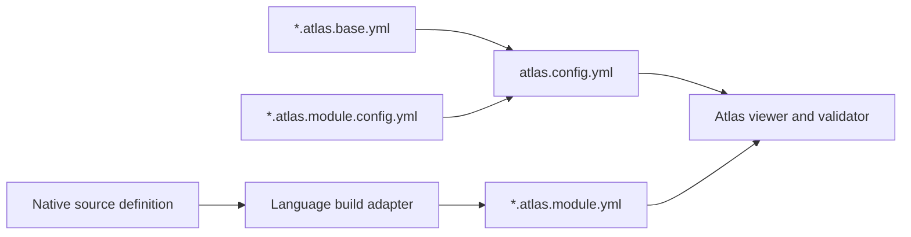

# Atlas v2 Configuration and Module Schemas

## Purpose

Atlas separates language-specific source analysis from language-agnostic project
processing. Native builds generate self-contained module models. One root Atlas
configuration composes optional shared base settings with an explicit ordered
module list, then tells the viewer and validator which generated models to load.



The version-two document families are:

| File                        | Ownership      | Purpose                                                                                                 |
| --------------------------- | -------------- | ------------------------------------------------------------------------------------------------------- |
| `atlas.config.yml`          | Human-authored | The single project root. It composes base settings and an explicit module list and owns project policy. |
| `*.atlas.base.yml`          | Human-authored | Reusable external-dependency diagram defaults extended by the root.                                     |
| `*.atlas.module.config.yml` | Human-authored | One complete module configuration: model path, tags, diagrams, and validation.                          |
| `*.atlas.module.yml`        | Generated      | The source-derived static structure of one build module.                                                |

There is exactly one root configuration per Atlas project. Referenced base and
module configurations are fragments, not alternative roots. Atlas never
scans for fragments, packages, projects, gems, build targets, or model files.

## Shared Conventions

### Document and schema rules

- Documents use UTF-8 YAML 1.2 and contain exactly one root mapping.
- `schemaVersion` is required and must equal `2`.
- Human-authored configuration documents require a `documentType` discriminator:
  `root`, `base`, or `module`.
- Unknown fields are errors. Each discriminator selects a separate closed schema.
- Required strings are trimmed, non-empty strings. IDs are otherwise opaque.
- Mapping key order has no meaning. Array order has meaning only where this
  document says it does.
- A generator writes deterministic YAML with the field order shown here and one
  trailing newline.

### Paths

- `/` is the persisted separator on every platform.
- `atlas.config.yml` is at the project root and is the only valid root document.
- Configuration-fragment paths are relative to the document containing them.
- Module `model` paths are relative to the artifact root's `model/` directory.
- Every configured path must resolve inside the project root after
  canonicalization and must not traverse a symbolic link outside that root.
- Referenced configuration fragments must exist and be regular files. A missing
  fragment is a configuration error; only a missing generated model is skippable.
- Paths in a generated module model are relative to the native module root and
  must not contain `.` or `..` segments.
- Base filenames end in `.atlas.base.yml`, referenced module-configuration
  filenames end in `.atlas.module.config.yml`, and generated model filenames end
  in `.atlas.module.yml`.

### Patterns

Atlas uses two small, portable pattern grammars:

- **Path patterns** match slash-normalized paths. `*` matches within one segment,
  `?` matches one non-separator character, and `**` matches zero or more complete
  segments. Matching is case-sensitive. Brace expansion, extglobs, and negation
  are not supported.
- **ID patterns** match an entire opaque ID. `*` matches zero or more characters
  and `?` matches one character. All other characters, including `/`, `:`, `@`,
  and `.`, are literal. Matching is case-sensitive.

## Composable Project Configuration

### Complete composed example

The following root, base fragment, and module fragment form one configuration.
The root demonstrates both permitted module-entry forms: a fragment path and an
inline module object.

#### Root `atlas.config.yml`

```yaml
schemaVersion: 2
documentType: root

extends:
  - config/team.atlas.base.yml

project:
  name: Reading List
  artifacts:
    root: architecture
  diagramDefaults:
    externalDependencies:
      excludeIds:
        - "node:*"
      collapse:
        mode: matching
        ids:
          - "@types/*"
          - "System.*"
  diagrams:
    - id: project-landscape
      title: Reading List landscape
      layout:
        orientation: horizontal
        rows: 6
        horizontalGap: 80
        verticalGap: 60
      externalDependencies:
        splitByModule: false
      groups:
        - id: core
          title: Core modules
          selector:
            moduleTags:
              - core
        - id: delivery
          title: Delivery modules
          selector:
            moduleTags:
              - delivery

modules:
  - packages/lib/atlas.module.config.yml

  - model: app.atlas.module.yml
    tags:
      - runtime
      - delivery
    diagrams:
      - id: app-overview
        title: Application module
        scope:
          type: module
      - id: app-composition
        title: Application composition
        scope:
          type: path
          path: src/composition
        layout:
          orientation: vertical
        filters:
          elementKinds:
            - class
            - function
            - method
          relationshipKinds:
            - references
            - calls
        externalDependencies:
          collapse:
            mode: all
    validation:
      rules:
        - id: domain-does-not-depend-on-composition
          type: dependency-direction
          severity: error
          mode: forbid
          relationships:
            - imports
            - references
            - calls
          from:
            sourcePaths:
              - src/domain/**
          to:
            sourcePaths:
              - src/composition/**

validation:
  rules:
    - id: no-runtime-module-cycles
      type: no-circular
      severity: error
      relationships:
        - imports
        - references
      within:
        moduleTags:
          - runtime

    - id: core-does-not-depend-on-delivery
      type: dependency-direction
      severity: error
      mode: forbid
      relationships:
        - imports
        - references
        - calls
      from:
        moduleTags:
          - core
      to:
        moduleTags:
          - delivery
```

#### `config/team.atlas.base.yml`

```yaml
schemaVersion: 2
documentType: base

diagramDefaults:
  externalDependencies:
    excludeIds:
      - "System.Runtime.*"
    collapse:
      mode: matching
      ids:
        - "Microsoft.Extensions.*"
```

#### `packages/lib/atlas.module.config.yml`

```yaml
schemaVersion: 2
documentType: module

model: lib.atlas.module.yml
tags:
  - runtime
  - core
diagrams:
  - id: lib-api
    title: Library API
    scope:
      type: module
    filters:
      elementKinds:
        - class
        - interface
        - function
      visibilities:
        - public
validation:
  rules:
    - id: lib-does-not-use-database-drivers
      type: forbid
      severity: error
      relationships:
        - imports
        - references
      to:
        externalIds:
          - "pg"
          - "Microsoft.Data.SqlClient*"
```

The model path in every module entry is relative to the artifact root's
`model/` directory. After canonical resolution, the example loads the same language-neutral model shape
regardless of which language adapter produced each file.

### Root schema

Only `atlas.config.yml` may use `documentType: root`.

| Field           | Type                          | Required | Rules                                                                           |
| --------------- | ----------------------------- | -------- | ------------------------------------------------------------------------------- |
| `schemaVersion` | integer                       | Yes      | Must equal `2`.                                                                 |
| `documentType`  | string                        | Yes      | Must equal `root`.                                                              |
| `extends`       | path[]                        | No       | Ordered, unique references to base fragments.                                   |
| `project`       | `ProjectConfiguration`        | Yes      | Defines project identity, artifacts, defaults, and project diagrams.            |
| `modules`       | non-empty `ModuleEntry[]`     | Yes      | Explicit modules in processing order. No discovery, globs, or directory values. |
| `validation`    | `RootValidationConfiguration` | No       | Rules over dependencies between successfully loaded modules.                    |

A `ModuleEntry` is exactly one of:

- A string path ending in `.atlas.module.config.yml`. Atlas loads the complete
  module fragment at that path; fields inside it resolve relative to the fragment.
- An inline `ModuleConfiguration` mapping. Its paths resolve relative to
  `atlas.config.yml`; it does not contain `schemaVersion` or `documentType`.

The root cannot reference another root. A canonical path cannot occur more than
once in `extends` or more than once as a module entry.

### Base-fragment schema

A base fragment supports only this closed shape:

| Field             | Type                      | Required | Rules                                                   |
| ----------------- | ------------------------- | -------- | ------------------------------------------------------- |
| `schemaVersion`   | integer                   | Yes      | Must equal `2`.                                         |
| `documentType`    | string                    | Yes      | Must equal `base`.                                      |
| `diagramDefaults` | `ExternalDiagramDefaults` | Yes      | Contains only external exclusion and collapse defaults. |

Base fragments cannot declare `extends`, project identity, artifacts, diagrams,
modules, tags, or validation rules. Only the root extends base fragments;
inheritance is intentionally one level deep.

### Module-fragment schema

A module fragment is exactly one `ModuleConfiguration` plus its discriminator:

| Field           | Type                            | Required | Rules                                                                            |
| --------------- | ------------------------------- | -------- | -------------------------------------------------------------------------------- |
| `schemaVersion` | integer                         | Yes      | Must equal `2`.                                                                  |
| `documentType`  | string                          | Yes      | Must equal `module`.                                                             |
| `model`         | path                            | Yes      | Generated model path relative to the artifact root's `model/` directory. Must end in `.atlas.module.yml`. |
| `tags`          | string[]                        | No       | Project-policy labels unique within this module.                                 |
| `diagrams`      | `ModuleDiagram[]`               | No       | Explicit diagrams with IDs unique within this module.                            |
| `validation`    | `ModuleValidationConfiguration` | No       | Rules owned by this module and evaluated from its elements.                      |

Module fragments cannot extend a base, reference another module fragment, or
declare root or project settings. Each fragment is a complete module entry and is
portable with its native build module.

### Composition and merge order

Atlas resolves a root configuration without searching the filesystem:

1. Parse the root and verify `documentType: root`.
2. Resolve every `extends` path relative to the root, validate the referenced
   document against the base schema, and apply fragments in listed order.
3. Merge `project.diagramDefaults` from the root last.
4. Walk the root `modules` array in declaration order. Validate mapping entries
   directly as `ModuleConfiguration`; resolve string entries relative to the root
   and validate the referenced document against the module-fragment schema.
5. Normalize every entry to one `ModuleConfiguration`, preserving module order
   and resolving every model beneath the artifact root's `model/` directory.
6. Reject duplicate canonical module-fragment and model paths.
7. Validate selectors, diagram IDs, groups, rules, and all remaining cross-field
   constraints against the composed result.

External defaults merge recursively. Later scalar values replace earlier values;
`excludeIds` and collapse `ids` append in source order and remove exact duplicates
while retaining the first occurrence. No other project or diagram fields
participate in inheritance.

Failure to read or validate any referenced fragment fails the configuration.
There is no fallback to a partially composed policy.

### Project configuration

| Field             | Type                      | Required | Default and rules                                                      |
| ----------------- | ------------------------- | -------- | ---------------------------------------------------------------------- |
| `name`            | string                    | Yes      | Human-readable project name.                                           |
| `artifacts.root`  | path                      | Yes      | Directory for generated project-level viewer and validation artifacts. |
| `diagramDefaults` | `ExternalDiagramDefaults` | No       | Root-local external defaults applied after extended fragments.         |
| `diagrams`        | `ProjectDiagram[]`        | No       | Explicit project landscapes with IDs unique across project diagrams.   |

A project diagram is a landscape of all successfully loaded modules and their
external dependencies. It has the common diagram fields plus optional `groups`.
Each group has a unique `id`, a non-empty `title`, and a module-only `selector`.
A loaded module may match at most one group in the same diagram; overlapping
groups are a configuration error. Unmatched modules remain ungrouped.

### Resolved module configuration

Composition normalizes inline modules and referenced fragments to this shape.
Every module entry supplies all of its own configuration.

| Field        | Type                            | Required | Rules                                                                                           |
| ------------ | ------------------------------- | -------- | ----------------------------------------------------------------------------------------------- |
| `model`      | path                            | Yes      | Model-root-relative generated file that supplies all source identity and metadata. Must end in `.atlas.module.yml`. |
| `tags`       | string[]                        | No       | Project-policy labels unique within the module entry.                                           |
| `diagrams`   | `ModuleDiagram[]`               | No       | Explicit diagrams with IDs unique within the module entry.                                      |
| `validation` | `ModuleValidationConfiguration` | No       | Module-owned rules; omission means this module declares none.                                   |

Tags are project policy, not source metadata, and are never copied into the
generated model. Atlas associates them with the derived module ID only after the
model loads successfully.

A module diagram has the common diagram fields and a required `scope`:

| Scope        | Fields               | Meaning                                                                                                                               |
| ------------ | -------------------- | ------------------------------------------------------------------------------------------------------------------------------------- |
| Whole module | `type: module`       | Projects all included elements owned by the loaded module.                                                                            |
| Source path  | `type: path`, `path` | Projects elements whose `source.path` equals the path or is below that directory. The path is module-root-relative and is not a glob. |

No diagram is implied by a module entry. An omitted or empty `diagrams` array is
valid and still makes the module available to project diagrams and validation.

### Diagram fields and defaults

Project and module diagrams share these fields:

| Field                  | Type                        | Required | Default and rules                                               |
| ---------------------- | --------------------------- | -------- | --------------------------------------------------------------- |
| `id`                   | string                      | Yes      | Stable diagram identity in its owning project or module scope.  |
| `title`                | string                      | Yes      | Viewer title.                                                   |
| `inheritDefaults`      | boolean                     | No       | `true`. When false, composed external defaults are not applied. |
| `layout`               | `LayoutOptions`             | No       | Applies only to this diagram. It is never inherited.            |
| `filters`              | `DiagramFilters`            | No       | Applies only to this diagram. It is never inherited.            |
| `externalDependencies` | `ExternalDependencyOptions` | No       | Merges over inherited external defaults for this diagram.       |

Default application is deterministic:

1. Start with built-in external presentation behavior.
2. If `inheritDefaults` is true, merge the composed external defaults.
3. Merge the diagram's `externalDependencies` last using the same scalar-replace
   and array-append/deduplicate rules.
4. Resolve this diagram's independent `layout` and `filters` without consulting
   project or base fragments.

#### External diagram defaults

`diagramDefaults` may contain only `externalDependencies.excludeIds` and
`externalDependencies.collapse`. Layout, element filters, relationship filters,
source-path filters, grouping, and `splitByModule` are invalid in a
`diagramDefaults` object.

#### Layout options

| Field           | Type                | Built-in fallback | Rules                      |
| --------------- | ------------------- | ----------------- | -------------------------- |
| `orientation`   | `LayoutOrientation` | `horizontal`      | Primary placement axis.    |
| `rows`          | integer             | `6`               | Must be greater than zero. |
| `horizontalGap` | number              | `80`              | Must be non-negative.      |
| `verticalGap`   | number              | `60`              | Must be non-negative.      |

The fallback is an implementation necessity, not an inheritable project default.
Each diagram may override it independently. `LayoutOrientation` is `horizontal`
or `vertical`.

#### Diagram filters

| Field                | Type                 | Meaning                                                                                |
| -------------------- | -------------------- | -------------------------------------------------------------------------------------- |
| `elementKinds`       | `ElementKind[]`      | Includes only these element kinds. Omission includes every kind.                       |
| `visibilities`       | `Visibility[]`       | Includes only these visibilities. Omission includes every visibility.                  |
| `traits`             | string[]             | Includes elements carrying at least one listed trait. Omission does not filter traits. |
| `relationshipKinds`  | `RelationshipKind[]` | Includes only these relationship kinds. Omission includes every kind.                  |
| `excludeSourcePaths` | path pattern[]       | Excludes elements whose source path matches any pattern.                               |

Filters are diagram-local and affect presentation only. They never remove facts
from validation. Relationships whose source or target element is filtered out are
omitted from that diagram.

#### External dependency options

| Field           | Type           | Built-in fallback | Rules                                                                                                                        |
| --------------- | -------------- | ----------------- | ---------------------------------------------------------------------------------------------------------------------------- |
| `excludeIds`    | ID pattern[]   | `[]`              | Excludes matching external targets. Allowed in composed defaults and diagrams.                                               |
| `collapse.mode` | `CollapseMode` | `all`             | Controls whether references to the same external identity share one node.                                                    |
| `collapse.ids`  | ID pattern[]   | `[]`              | Used only with `matching`; the effective merged list must then be non-empty.                                                 |
| `splitByModule` | boolean        | `false`           | Diagram-local. In a project diagram, separates a collapsed target by importing module; it has no effect in a module diagram. |

`CollapseMode` is `all`, `matching`, or `none`.

### Selectors

Atlas uses separate selector schemas at the project and module boundaries.
Values within one field are ORed; populated fields are ANDed. Arrays must be
non-empty and contain unique values, and every selector must contain at least one
field.

A `ModuleSelector` contains only:

| Field        | Pattern/value type | Matches                                        |
| ------------ | ------------------ | ---------------------------------------------- |
| `moduleIds`  | ID pattern[]       | Derived IDs of successfully loaded modules.    |
| `moduleTags` | string[]           | Tags on the corresponding config module entry. |

An `ElementSelector` contains only:

| Field          | Pattern/value type | Matches                                |
| -------------- | ------------------ | -------------------------------------- |
| `elementKinds` | `ElementKind[]`    | Elements of the listed kinds.          |
| `visibilities` | `Visibility[]`     | Elements with a normalized visibility. |
| `traits`       | string[]           | Elements carrying a listed trait.      |
| `sourcePaths`  | path pattern[]     | Module-relative element source paths.  |

Project-diagram groups use `ModuleSelector`. Validation selects modules or
elements only where its owning schema explicitly permits that selector type.

### Validation

Validation has two closed schemas. Root rules enforce project boundaries between
modules. Module rules enforce structure inside one module or constrain its
outbound dependencies. Moving a rule between these locations can therefore
change its meaning and is never an implicit merge operation.

Both `RootValidationConfiguration` and `ModuleValidationConfiguration` contain
exactly one field, `rules`. When a validation object is present, `rules` must be
a non-empty array. Validation blocks are not inherited or merged.

All rules require `id`, `type`, `severity`, and a non-empty `relationships` array
whose values are unique `RelationshipKind` values. Rule IDs are unique within
their owning validation block. Severity is `error` or `warning`; at least one
error violation causes a non-zero validation result. Diagnostics identify root
rules by rule ID and module rules by `<derived-module-id>:<rule-id>`.

#### Root validation

`RootValidationConfiguration.rules` accepts only the following rule types and
evaluates only relationships whose source and target belong to different,
successfully loaded modules. Same-module edges and external targets are ignored.

| Type                   | Additional fields                                                               | Semantics                                                                                                                                  |
| ---------------------- | ------------------------------------------------------------------------------- | ------------------------------------------------------------------------------------------------------------------------------------------ |
| `no-circular`          | Optional `within: ModuleSelector`                                               | Collapses selected relationships to module edges and reports strongly connected components. Omitted `within` includes every loaded module. |
| `dependency-direction` | `mode` (`allow-only` or `forbid`), `from: ModuleSelector`, `to: ModuleSelector` | `forbid` rejects selected edges into `to`; `allow-only` rejects selected edges whose target does not match `to`.                           |

Root rules cannot select elements or external IDs. `no-circular` has no `level`
field because its root location unambiguously makes it module-level.

#### Module validation

`ModuleValidationConfiguration.rules` evaluates relationships originating in the
owning, successfully loaded module. It accepts only:

| Type                   | Additional fields                                                                     | Semantics                                                                                                 |
| ---------------------- | ------------------------------------------------------------------------------------- | --------------------------------------------------------------------------------------------------------- |
| `no-circular`          | Optional `within: ElementSelector`                                                    | Reports cycles among matching elements in the owning module. Omitted `within` includes every element.     |
| `dependency-direction` | `mode` (`allow-only` or `forbid`), `from: ElementSelector`, `to: ElementSelector`     | Enforces direction among elements in the owning module. Cross-module and external targets are ignored.    |
| `forbid`               | Optional `from: ElementSelector`; required `to` with exactly one target-selector form | Rejects matching local or outbound edges. Omitted `from` means every source element in the owning module. |

The three closed `forbid.to` selector forms are:

- `ModuleTargetSelector`: `moduleIds`, `moduleTags`, or both. It matches loaded
  target modules other than the owning module.
- `ElementTargetSelector`: one or more `ElementSelector` fields. It matches
  target elements in the owning module.
- `ExternalTargetSelector`: exactly one `externalIds` field containing a
  non-empty, unique array of ID patterns.

Fields from different target forms cannot be mixed. Module `no-circular` has no
`level` field because its location unambiguously makes it element-level. The
general `forbid` rule replaces special-purpose forbidden-import,
forbidden-package, and forbidden-module rules.

### Loading and partial projects

After configuration composition succeeds, Atlas loads generated models as follows:

1. Use the composed module list in root declaration order; never scan a directory
   or build definition.
2. Attempt to read every configured model.
3. Emit one warning for each missing generated model and skip its diagrams, tags,
   and module validation.
4. Fail immediately when a present file is invalid; a malformed output is not
   treated as missing.
5. Reject duplicate derived module IDs among loaded models.
6. Fail when no configured model loads successfully.
7. Generate project diagrams and evaluate root and loaded-module rules against
   the loaded subset.

A subset result includes the number and paths of missing modules in viewer and
validation diagnostics. Missing modules do not by themselves make validation
fail, and validation may pass for the loaded subset. Consumers must not present
that result as complete-project coverage.

## `*.atlas.module.yml`

### Complete example

```yaml
schemaVersion: 2

generator:
  name: atlas-ts
  version: 2.0.0

source:
  language: typescript
  languageVersion: 5.9.2

module:
  id: "@reading-list/lib"
  name: "@reading-list/lib"
  version: 1.4.0
  category: npm-package

elements:
  - id: "source:src/ReadingList.ts"
    kind: source-unit
    name: ReadingList.ts
    qualifiedName: src/ReadingList.ts
    visibility: internal
    source:
      path: src/ReadingList.ts
      start:
        line: 1
        column: 1
      end:
        line: 24
        column: 2

  - id: "type:ReadingList"
    kind: class
    name: ReadingList
    qualifiedName: ReadingList
    parentId: "source:src/ReadingList.ts"
    visibility: public
    traits:
      - exported
    source:
      path: src/ReadingList.ts
      start:
        line: 3
        column: 1
      end:
        line: 23
        column: 2

  - id: "method:ReadingList.add(string)"
    kind: method
    name: add
    qualifiedName: ReadingList.add
    parentId: "type:ReadingList"
    visibility: public
    signature:
      typeParameters: []
      parameters:
        - "parameter:ReadingList.add:title"
      returns:
        kind: named
        name: ReadingListItem
        target:
          elementId: "type:ReadingListItem"
    source:
      path: src/ReadingList.ts
      start:
        line: 8
        column: 3
      end:
        line: 12
        column: 4

  - id: "parameter:ReadingList.add:title"
    kind: parameter
    name: title
    qualifiedName: ReadingList.add.title
    parentId: "method:ReadingList.add(string)"
    visibility: local
    type:
      kind: named
      name: string
    parameter:
      position: 0
      optional: false
      variadic: false
      passing: value
    source:
      path: src/ReadingList.ts
      start:
        line: 8
        column: 7
      end:
        line: 8
        column: 20

relationships:
  - id: "relationship:add-references-item"
    sourceElementId: "method:ReadingList.add(string)"
    kind: references
    target:
      type: element
      elementId: "type:ReadingListItem"
    source:
      path: src/ReadingList.ts
      start:
        line: 8
        column: 24
      end:
        line: 8
        column: 39

  - id: "relationship:add-calls-slugify"
    sourceElementId: "method:ReadingList.add(string)"
    kind: calls
    target:
      type: external
      id: slugify
      name: slugify
    source:
      path: src/ReadingList.ts
      start:
        line: 10
        column: 18
      end:
        line: 10
        column: 32
```

### Root fields

| Field           | Type                | Required | Rules                                                           |
| --------------- | ------------------- | -------- | --------------------------------------------------------------- |
| `schemaVersion` | integer             | Yes      | Must equal `2`.                                                 |
| `generator`     | `GeneratorMetadata` | Yes      | Identifies the adapter, not project policy.                     |
| `source`        | `SourceMetadata`    | Yes      | Source language is metadata and has no core semantic branching. |
| `module`        | `ModuleIdentity`    | Yes      | Derived exclusively from the native source definition.          |
| `elements`      | `Element[]`         | Yes      | May be empty. IDs must be unique within this module.            |
| `relationships` | `Relationship[]`    | Yes      | May be empty. IDs must be unique within this module.            |

### Metadata and module identity

| Field                    | Type   | Required | Meaning                                                                    |
| ------------------------ | ------ | -------- | -------------------------------------------------------------------------- |
| `generator.name`         | string | Yes      | Stable generator name such as `atlas-ts`.                                  |
| `generator.version`      | string | Yes      | Generator package or executable version.                                   |
| `source.language`        | string | Yes      | Lowercase language ID such as `typescript`, `kotlin`, `ruby`, or `csharp`. |
| `source.languageVersion` | string | No       | Compiler/parser language version used for extraction.                      |
| `module.id`              | string | Yes      | Opaque, source-derived identity used for project linking.                  |
| `module.name`            | string | Yes      | Source-derived human-readable name.                                        |
| `module.version`         | string | Yes      | Source-derived version.                                                    |
| `module.variant`         | string | No       | Source-derived target or build variant.                                    |
| `module.category`        | string | Yes      | Portable artifact family label. Core treats it as metadata.                |

Core code must not parse ecosystem semantics from `module.id`, `variant`, or
`category`. Their values may describe source concepts; their structure and use
remain language-independent.

### Elements

Every element has these common fields:

| Field           | Type                    | Required | Rules                                                                                          |
| --------------- | ----------------------- | -------- | ---------------------------------------------------------------------------------------------- |
| `id`            | string                  | Yes      | Stable and unique within the module.                                                           |
| `kind`          | `ElementKind`           | Yes      | One value from the normalized vocabulary.                                                      |
| `name`          | string                  | Yes      | Short display name. Anonymous constructs use a stable generated name based on source location. |
| `qualifiedName` | string                  | Yes      | Stable source-qualified identity. It need not use the same separator across source languages.  |
| `parentId`      | string                  | No       | Must reference another element in this module and must not create a parent cycle.              |
| `visibility`    | `Visibility`            | Yes      | Normalized visibility.                                                                         |
| `traits`        | string[]                | No       | Unique, sorted portable or source-metadata traits.                                             |
| `source`        | `SourceSpan`            | No       | Required for source-owned elements; may be absent for compiler-synthesized declarations.       |
| `type`          | `TypeExpression`        | No       | Declared or safely inferred value/type-alias type.                                             |
| `signature`     | `CallableSignature`     | No       | Required for callable kinds.                                                                   |
| `parameter`     | `ParameterMetadata`     | No       | Required only for `parameter` elements.                                                        |
| `typeParameter` | `TypeParameterMetadata` | No       | Required only for `type-parameter` elements.                                                   |

#### Element kinds

| Family      | Kinds                                                                                    |
| ----------- | ---------------------------------------------------------------------------------------- |
| Ownership   | `namespace`, `source-unit`                                                               |
| Named types | `class`, `interface`, `struct`, `record`, `enum`, `annotation`, `delegate`, `type-alias` |
| Callables   | `function`, `local-function`, `constructor`, `method`                                    |
| Values      | `property`, `field`, `constant`, `event`, `enum-member`, `parameter`, `local-variable`   |
| Generics    | `type-parameter`                                                                         |

Nested and local types retain their named-type kind and use `parentId` to express
their scope. Accessors, operators, destructors, and anonymous callables use the
closest callable kind plus a trait such as `getter`, `setter`, `operator`,
`finalizer`, or `anonymous`.

#### Visibility

`visibility` is one of `public`, `protected`, `internal`, `private`, `local`, or
`unknown`. Combined or source-specific access forms use the nearest normalized
value and retain the exact distinction as a trait, for example
`protected-internal`.

#### Source spans

A source span contains:

- `path`: slash-normalized path relative to the native module root.
- `start.line` and `start.column`: 1-based inclusive position.
- `end.line` and `end.column`: 1-based exclusive position.

The end must not precede the start. A relationship span identifies the syntax
that created the edge. Generated source uses a deterministic path below
`generated/`; workstation-specific absolute paths are forbidden.

#### Callable signatures

`signature` contains:

| Field            | Type             | Required    | Rules                                                                     |
| ---------------- | ---------------- | ----------- | ------------------------------------------------------------------------- |
| `typeParameters` | element ID[]     | Yes         | Ordered declaration IDs of child `type-parameter` elements. May be empty. |
| `parameters`     | element ID[]     | Yes         | Ordered declaration IDs of child `parameter` elements. May be empty.      |
| `returns`        | `TypeExpression` | Conditional | Required for functions and methods; forbidden for constructors.           |

Listed parameter and type-parameter elements must have the callable as their
`parentId`. Each list preserves source declaration order and contains no duplicate
IDs.

`parameter` metadata contains zero-based `position`, `optional`, `variadic`, and
`passing`. `passing` is one of `value`, `reference`, `output`, or `receiver`.
Every parameter also has a `type`; use `unknown` when the source provides no
reliable type.

`typeParameter` metadata contains `variance` (`invariant`, `in`, or `out`) and an
ordered `constraints` array of type expressions. Omitted variance is equivalent
to `invariant`; omitted constraints are equivalent to an empty array.

### Type expressions

Every type expression is a mapping discriminated by `kind`:

| Kind             | Required fields            | Meaning                                                                                                                                                                            |
| ---------------- | -------------------------- | ---------------------------------------------------------------------------------------------------------------------------------------------------------------------------------- |
| `named`          | `name`                     | Named type. Optional `arguments` contains generic arguments; optional `target` contains `elementId` and optional `moduleId`.                                                       |
| `union`          | `types`                    | Two or more unique alternatives.                                                                                                                                                   |
| `intersection`   | `types`                    | Two or more unique conjuncts.                                                                                                                                                      |
| `tuple`          | `elements`                 | Ordered entries containing optional `name` and required `type`.                                                                                                                    |
| `callable`       | `parameters`, `returns`    | Ordered parameter types and result type. Callable parameters may additionally declare `name`, `optional`, and `variadic`.                                                          |
| `collection`     | `collection`, shape fields | `collection` is `array`, `sequence`, `set`, or `map`. Arrays require `element` and optional positive `rank`; sequences and sets require `element`; maps require `key` and `value`. |
| `nullable`       | `type`                     | Nullable wrapper around a non-nullable expression.                                                                                                                                 |
| `literal`        | `value`                    | String, number, boolean, or null literal type.                                                                                                                                     |
| `type-parameter` | `elementId`                | Reference to an owned `type-parameter` element.                                                                                                                                    |
| `dynamic`        | none                       | Source explicitly permits dynamic dispatch or dynamic type behavior.                                                                                                               |
| `unknown`        | none                       | No safe type is available. This must not be guessed into a named type.                                                                                                             |
| `void`           | none                       | Callable does not return a value.                                                                                                                                                  |
| `never`          | none                       | Callable or expression cannot complete normally.                                                                                                                                   |

Recursive expressions must be finite. Union and intersection order is
semantically irrelevant and must be serialized by canonical expression order.
Tuple, callable parameter, and generic argument order is semantically significant
and must be preserved.

### Relationships

Every relationship contains:

| Field             | Type                 | Required | Rules                                           |
| ----------------- | -------------------- | -------- | ----------------------------------------------- |
| `id`              | string               | Yes      | Stable and unique within the module.            |
| `sourceElementId` | string               | Yes      | Must reference an element in this module.       |
| `kind`            | `RelationshipKind`   | Yes      | One normalized relationship kind.               |
| `target`          | `RelationshipTarget` | Yes      | Exactly one discriminated target shape.         |
| `source`          | `SourceSpan`         | No       | Source syntax responsible for the relationship. |

Relationship kinds are:

| Kind           | Meaning                                                               |
| -------------- | --------------------------------------------------------------------- |
| `imports`      | Source unit introduces a dependency name from another unit or module. |
| `exports`      | Source unit exposes a declaration or re-exports another unit.         |
| `references`   | Declaration uses a target as a type or value.                         |
| `inherits`     | Type derives implementation from a base type.                         |
| `implements`   | Type fulfills or mixes in a contract.                                 |
| `calls`        | Callable invokes another callable.                                    |
| `instantiates` | Declaration creates an instance of a type.                            |
| `reads`        | Declaration reads a target value.                                     |
| `writes`       | Declaration assigns or mutates a target value.                        |
| `overrides`    | Callable or property overrides an inherited member.                   |
| `decorates`    | Annotation, attribute, or decorator applies to a declaration.         |

Containment is not a relationship kind. `parentId` is the sole structural
ownership representation.

Targets use exactly one of these shapes:

```yaml
- type: element # Element in this module
  elementId: "type:ReadingListItem"

- type: element # Element in another module
  moduleId: "@reading-list/contracts"
  elementId: "type:ReadingListItem"

- type: module # Whole-module dependency
  moduleId: "@reading-list/contracts"

- type: external # Unresolved or third-party identity
  id: slugify
  name: slugify
```

`name` is optional presentation metadata for external targets. An external `id`
must be stable within its source ecosystem. If a generator knows an exact module
or element identity, it must use that target shape rather than an external target.

A local element target must exist. A target in another successfully loaded module
must exist when it includes an element ID. A module target that is not loaded is
retained as an unresolved module boundary; missing configured models must not
corrupt otherwise valid source facts.

### Determinism and semantic validation

- Elements sort lexicographically by `id`; relationships sort lexicographically
  by `id`; traits sort lexicographically.
- Callable parameter and type-parameter references preserve declaration order.
- IDs remain stable when unrelated declarations are added or reordered.
- `parentId` and local target references must resolve and parent graphs must be
  acyclic.
- Kind-specific fields are rejected on incompatible kinds.
- Duplicate facts with different IDs are invalid; generators must deduplicate
  facts before serialization.
- Source-language syntax trees, compiler objects, absolute paths, timestamps,
  and build-machine identifiers must never appear in the model.

## Native Build Integration Configuration

Build integrations are module-local. Applying an integration to one native build
module configures only the model or models produced by that build. Root Atlas
configuration remains the only project-level aggregation mechanism.

Every adapter must pass an immutable generation request to its language CLI or
SDK and write atomically beneath the configured artifact root's `model/`
directory. The filename is derived from the native build target; build
configuration never supplies an exact model file.

### TypeScript npm configuration

Each analyzed package declares an `atlas` object in its own `package.json`:

```json
{
  "name": "@reading-list/lib",
  "version": "1.4.0",
  "atlas": {
    "rootDirectory": "../../architecture",
    "tsconfigFile": "tsconfig.json",
    "generateOnBuild": true
  }
}
```

| Field             | Required | Default and behavior                                                                                 |
| ----------------- | -------- | ---------------------------------------------------------------------------------------------------- |
| `rootDirectory`   | Yes      | Shared Atlas artifact root relative to this `package.json`.                                          |
| `tsconfigFile`    | Yes      | Compiler configuration relative to this package. Its resolved file set is the complete source input. |
| `generateOnBuild` | No       | `true`; wires generation into this package's build only.                                             |

The adapter passes package root, package definition, `tsconfig`, and artifact root
to `atlas-ts`. It must not read npm workspaces or search for other packages.
Package `name` and `version` are required. The module category is `npm-package`;
the module ID and name are the package name.

### Kotlin Gradle configuration

Each analyzed Gradle project applies the plugin and explicitly registers its own
target models:

```kotlin
atlas {
    rootDirectory.set(rootProject.layout.projectDirectory.dir("architecture"))
    models {
        create("jvm") {
            target.set("jvm")
            compilation.set("main")
            semanticFragments.from(layout.buildDirectory.dir("generated/ksp/main"))
            generateOnBuild.set(true)
        }
    }
}
```

| Field               | Required | Default and behavior                                               |
| ------------------- | -------- | ------------------------------------------------------------------ |
| `target`            | Yes      | Exact Kotlin target name; wildcards are invalid.                   |
| `compilation`       | Yes      | Exact compilation, normally `main`.                                |
| `semanticFragments` | No       | Explicit KSP fragment files or directories for this target.        |
| `generateOnBuild`   | No       | `true`; wires generation into this project's selected compilation. |

The target compilation supplies source roots, language version, classpath, and
generated sources. The plugin must not apply itself to subprojects or enumerate
targets. Each registered target produces one model. Module ID is
`group:name:version:target`, name and version come from the evaluated Gradle
project/publication, variant is the target, and category is derived from the
applied Kotlin/Android artifact plugin.

### Ruby Rake configuration

Each analyzed gem or application configures its own Rake integration:

```ruby
Atlas::Rake.configure do |atlas|
  atlas.root_directory = "../../architecture"
  atlas.gemspec_file = "reading-list-app.gemspec"
  atlas.source_roots = ["lib"]
  atlas.route_files = []
  atlas.generate_on_build = true
end
```

| Field               | Required    | Default and behavior                                                    |
| ------------------- | ----------- | ----------------------------------------------------------------------- |
| `root_directory`    | Yes         | Shared Atlas artifact root relative to the configuring `Rakefile`.      |
| `gemspec_file`      | No          | Exact gemspec path. No gemspec search is performed.                     |
| `source_roots`      | Conditional | Defaults to gemspec `require_paths`; required when there is no gemspec. |
| `route_files`       | No          | Explicit Rails route files. Default is empty.                           |
| `generate_on_build` | No          | `true`; wires generation into this Rake build only.                     |

A gem derives ID/name, version, and category `ruby-gem` from its gemspec. A
gemless application derives ID/name from the module-root directory, uses version
`0.0.0`, and category `ruby-application`. Its source roots remain explicit.

### C# MSBuild configuration

Each analyzed project imports the integration and configures the shared artifact
root:

```xml
<PropertyGroup>
  <AtlasRootDirectory>$(MSBuildProjectDirectory)/../../architecture</AtlasRootDirectory>
  <AtlasGenerateOnBuild>true</AtlasGenerateOnBuild>
</PropertyGroup>
```

| Property               | Required | Default and behavior                                                                                                                |
| ---------------------- | -------- | ----------------------------------------------------------------------------------------------------------------------------------- |
| `AtlasRootDirectory`   | Yes      | Shared Atlas artifact root. The integration derives a project-and-target-specific filename beneath `model/`.                       |
| `AtlasGenerateOnBuild` | No       | `true`; runs once for each explicitly built target framework.                                                                       |

The adapter passes the current project path, evaluated build configuration,
target framework, compilation, and artifact root to `atlas-cs`. It must not search
for solutions or projects. `PackageId` supplies the preferred name, with
`AssemblyName` and project name as source-definition fallbacks. ID is
`<name>@<TargetFramework>`, version comes from evaluated package/version
properties, variant is the target framework, and category is
`dotnet-application` or `dotnet-library` according to `OutputType`.

## Language-to-Model Mappings

All adapters use the same element, type, and relationship vocabulary. They may
emit different levels of detail when their compiler or parser cannot prove the
same fact. Missing knowledge is represented as `unknown` or omitted according to
the field contract, never by guessing.

### TypeScript

| TypeScript structure                                   | Atlas representation                                                                                                                            |
| ------------------------------------------------------ | ----------------------------------------------------------------------------------------------------------------------------------------------- |
| `package.json` package                                 | Source-derived module identity; category `npm-package`.                                                                                         |
| Source file                                            | `source-unit`.                                                                                                                                  |
| Namespace or internal/external module declaration      | `namespace`.                                                                                                                                    |
| Class, interface, type alias, enum                     | Corresponding named-type kind.                                                                                                                  |
| Constructor, method, function, local function          | Corresponding callable kind. Getters, setters, generators, async functions, and operators retain traits.                                        |
| Property, class field, top-level variable, enum member | `property`, `field`/`constant`, or `enum-member`; local bindings are `local-variable`.                                                          |
| Parameter or generic parameter                         | `parameter` or `type-parameter`, including optional, rest, constraint, and variance metadata when available.                                    |
| Exported top-level declaration                         | `public` with `exported`; non-exported top-level declaration is `internal`. Member access modifiers map directly; `#private` is `private`.      |
| Type annotation or inferred compiler type              | Normalized type expression. Conditional, mapped, or otherwise unrepresentable compiler types use the closest safe normalized form or `unknown`. |
| `import`/`require` and export/re-export                | `imports` and `exports`.                                                                                                                        |
| `extends` and `implements`                             | `inherits` and `implements`, respectively.                                                                                                      |
| Type/value use, invocation, `new`, read, assignment    | `references`, `calls`, `instantiates`, `reads`, or `writes`.                                                                                    |
| Override and decorator                                 | `overrides` or `decorates`.                                                                                                                     |

Compiler symbols resolve aliases and re-exports to their backing declarations
when unambiguous. A package dependency that cannot be resolved to a configured
source module remains an external target with its normalized package ID.

### Kotlin

| Kotlin structure                                                  | Atlas representation                                                                                                                         |
| ----------------------------------------------------------------- | -------------------------------------------------------------------------------------------------------------------------------------------- |
| Gradle target compilation                                         | One source-derived module; target is the variant.                                                                                            |
| Package and Kotlin file                                           | `namespace` and child `source-unit`.                                                                                                         |
| Class, interface, enum class, annotation class, type alias        | Corresponding named-type kind.                                                                                                               |
| Object or companion object                                        | `class` with `singleton` and optional `companion` traits.                                                                                    |
| Primary/secondary constructor, function, local function           | `constructor`, `method`/`function`, or `local-function`. Extension and suspend behavior are traits.                                          |
| Property, backing field, enum entry, local variable               | `property`, `field`, `enum-member`, or `local-variable`. `val`/`var`, `const`, and `lateinit` become traits.                                 |
| Value/type parameter                                              | `parameter` or `type-parameter`, including receiver parameters, variance, and bounds.                                                        |
| Kotlin visibility                                                 | Direct normalized visibility; local declarations use `local`. Data, sealed, value, functional, inline, operator, and infix facts are traits. |
| Kotlin type                                                       | Normalized type expression, including generics, function types, nullability, and star/unknown arguments.                                     |
| Import, supertype, type/value use, call, construction, read/write | Corresponding normalized relationship. Class bases use `inherits`; interface contracts and delegation use `implements`.                      |
| Override and annotation                                           | `overrides` and `decorates`.                                                                                                                 |

KSP facts replace less precise parser facts for the same stable relationship.
KSP compiler objects and fragment paths never cross the module-model boundary.

### Ruby

| Ruby structure                                                          | Atlas representation                                                                                |
| ----------------------------------------------------------------------- | --------------------------------------------------------------------------------------------------- |
| Gemspec or gemless module root                                          | Source-derived `ruby-gem` or `ruby-application` module identity.                                    |
| Ruby file                                                               | `source-unit`.                                                                                      |
| Module                                                                  | `namespace`; reopenings remain separate source-owned elements sharing a qualified name.             |
| Class                                                                   | `class`.                                                                                            |
| Instance/singleton method, `initialize`, top-level method, block/lambda | `method`, `constructor`, `function`, or `local-function`; singleton and anonymous facts are traits. |
| Literal `attr_reader`, `attr_writer`, `attr_accessor`                   | `property` elements only when names are statically known.                                           |
| Constant and local assignment                                           | `constant` or `local-variable`.                                                                     |
| Method/block parameter                                                  | `parameter`, including optional, keyword, rest, and block traits.                                   |
| Ruby visibility directive                                               | `public`, `protected`, or `private`; local values use `local`.                                      |
| Ruby value or return type                                               | `unknown` unless a supported static signature source proves a normalized type.                      |
| `require`, `require_relative`, `load`, `autoload`                       | `imports`.                                                                                          |
| Superclass, `include`/`prepend`, `extend`                               | `inherits`, `implements`, or `references`.                                                          |
| Statically attributable call, construction, constant use, read/write    | Corresponding normalized relationship.                                                              |

Literal Rails associations, validators, callbacks, delegates, and routes may add
relationships when their targets are statically identifiable. They do not
synthesize framework-generated declarations. Dynamic metaprogramming is omitted.

### C#

| C# structure                                                       | Atlas representation                                                                                                                                                  |
| ------------------------------------------------------------------ | --------------------------------------------------------------------------------------------------------------------------------------------------------------------- |
| Evaluated project target                                           | One source-derived module with target framework variant.                                                                                                              |
| Namespace and physical/generated document                          | `namespace` and `source-unit`; generated documents use deterministic `generated/` paths.                                                                              |
| Class, interface, struct, record, enum, attribute, delegate        | Corresponding named-type kind.                                                                                                                                        |
| Constructor, method, local function, operator, accessor, finalizer | Corresponding callable kind plus `operator`, `getter`, `setter`, or `finalizer` trait where applicable.                                                               |
| Property, field, constant, event, enum member, local variable      | Corresponding value kind.                                                                                                                                             |
| Parameter or generic parameter                                     | `parameter` or `type-parameter`, including ref/out/in, variance, and constraints.                                                                                     |
| C# accessibility                                                   | Direct normalized visibility. Combined access forms retain exact traits. Static, abstract, sealed, partial, readonly, async, iterator, and required facts are traits. |
| Roslyn type symbol                                                 | Normalized type expression, including constructed generics, tuples, arrays, nullability, delegates, dynamic, void, and type parameters.                               |
| `using`, base class/interface, type use, call, `new`, read/write   | Corresponding normalized relationship.                                                                                                                                |
| Override and attribute                                             | `overrides` and `decorates`.                                                                                                                                          |

Roslyn symbol identity resolves relationships across explicitly loaded project
targets when possible. Compilation errors fail C# model generation because an
incomplete compilation cannot produce a trustworthy static model.

## Implementation Acceptance Criteria

The schema implementation driven by this document is complete when:

1. Core configuration has no package discovery, source-root, compiler, build
   system, or source-language-specific fields.
2. Each language integration can generate one valid version-two model without
   invoking project-level Atlas behavior.
3. Atlas accepts exactly one `root` document, extends only explicitly listed
   `base` fragments, and requires a non-empty ordered `modules` array.
4. Missing or invalid configuration fragments fail composition; no partial
   configuration is evaluated.
5. Every module entry is either an inline complete `ModuleConfiguration` or a
   path to one complete `module` fragment; module fragments cannot compose other
   configuration files.
6. Atlas core loads only model paths produced by the composed configuration.
7. Missing generated models are warned and skipped; invalid present models and a
   zero-model result fail.
8. Shared diagram defaults contain only external-ID exclusion and collapse
   behavior; layout and filters remain diagram-local.
9. Root validation evaluates only inter-module dependencies, while module
   validation evaluates local structure and dependencies originating in its
   owning module.
10. A single project can load valid models from all four language adapters.
11. Schema and semantic validation enforce every required field, enum,
    kind-specific constraint, path rule, uniqueness rule, and reference rule
    defined above.
12. Project and module diagrams are created only when explicitly configured, and
    their external defaults resolve deterministically.
13. Validation rules operate on the complete facts from the loaded subset,
    independently of diagram filters.
14. Repeated generation from unchanged source produces byte-for-byte identical
    module YAML.
