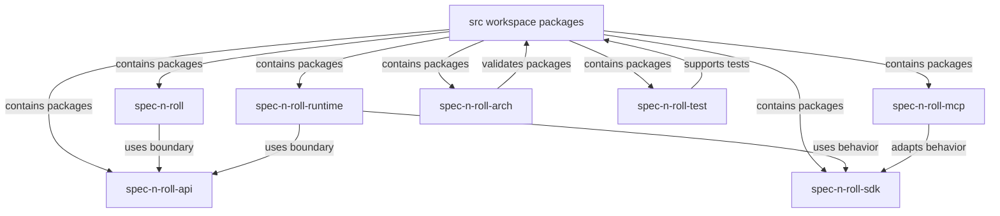

# Workspace packages - src

This directory contains the workspace package set for the current spec-n-roll implementation. Each child directory is an npm workspace package with an explicit execution, library, architecture, or test-support responsibility.

## Structure

## Conventions

### Package boundaries

Keep behavior inside the package that owns the reason to change. Cross-package data contracts belong in `spec-n-roll-api`, reusable business behavior belongs in `spec-n-roll-sdk`, and executable transports should adapt those boundaries instead of duplicating rules.

### Local documentation

Every package directory and package source directory keeps its own `README.md`. Update the nearest README when a change alters a directory's purpose, conventions, or architectural role.
