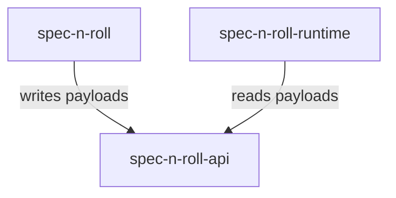

# spec-n-roll-api - package root

This package owns the stable contracts shared across dispatcher, runtime, and project-local package boundaries. It describes version-sensitive paths, runtime invocation payloads, dispatcher install metadata, and project-root resolution concepts without depending on executable implementations.

## Structure

## Conventions

### Contract ownership

Place only cross-boundary vocabulary in this package. Avoid importing dispatcher, runtime, SDK, MCP, architecture, or test implementation details into the API package.

### Compatibility

Because dispatchers and runtimes can be installed in different locations, exported types and constants should encode install-location assumptions directly. Keep the contract vocabulary stable enough for cross-package payload exchange without exposing executable package internals.
