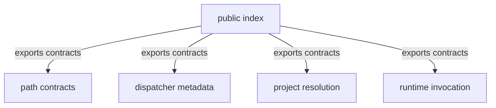

# API source - src

This directory contains the shared boundary contracts for dispatcher metadata, install-source classification, runtime target selection, project-root resolution, and runtime invocation payloads. The source is intentionally representation-focused because its primary purpose is stable cross-process vocabulary.

## Structure

## Conventions

### Export surface

Use the package index as the public API surface for consumers. Add new source files for distinct contract concepts, then expose only the contracts that should be shared across package boundaries.

### Contract design

For payload and path contract types in this directory, name fields for their serialized form and document the constraints callers must preserve. Leave parsing, filesystem access, and process behavior to executable packages so these files remain contract-only.
