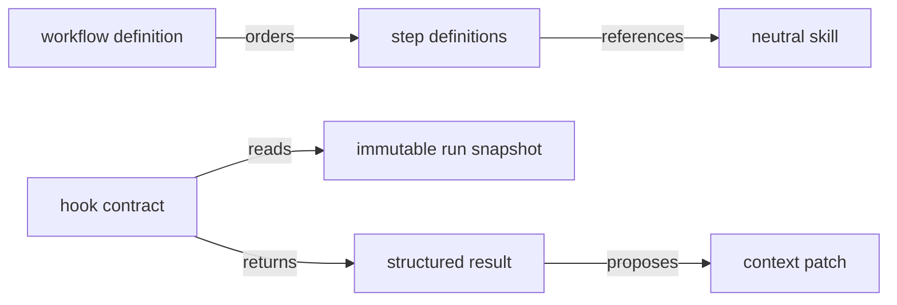

# Workflow contracts

This directory contains versioned, transport-neutral workflow and step
definitions together with hook execution contracts and the minimal workflow run
snapshot visible at hook boundaries.

## Structure

## Conventions

### Versioning

Hook inputs and results carry an explicit contract version. Breaking contract
changes require a new versioned type rather than changing the meaning of an
existing version.

### Mutation boundary

Hooks receive immutable snapshots and propose top-level context changes through
`contextPatch`. The workflow core owns validation and application of those
patches. Control fields named by `WORKFLOW_RUN_CONTROL_FIELDS` are reserved and
must never be accepted from a hook patch.
