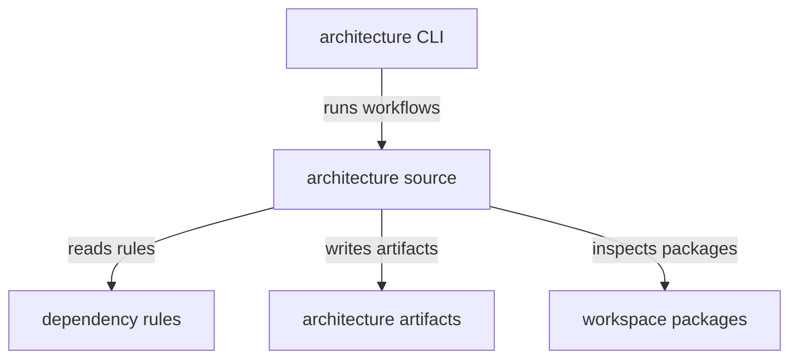

# spec-n-roll-arch - package root

This package owns workspace architecture validation and dependency visualization. It treats architecture checks and generated diagrams as development artifacts that describe package relationships rather than runtime behavior.

## Structure

## Conventions

### Validation scope

Keep architecture policy focused on package dependencies and generated visualization data. Runtime architecture contracts should remain in `spec-n-roll-api`, not in this package.

### Generated artifacts

Architecture outputs belong under the package's artifact directories. Source code should model artifact generation through injectable readers, runners, converters, and writers.
