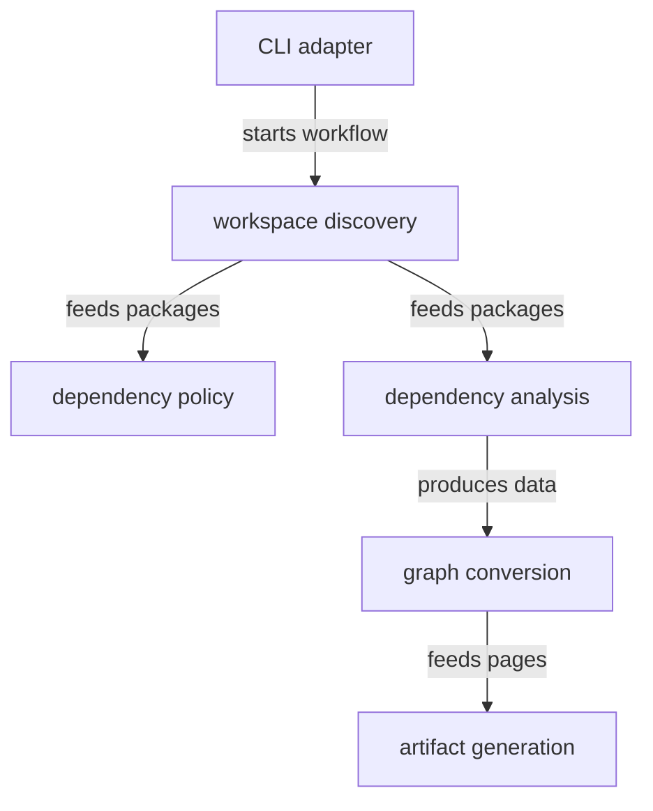

# Architecture source - src

This directory contains the architecture CLI, workspace package discovery, dependency-cruiser orchestration, Cytoscape conversion, and artifact generation workflows. The code turns dependency information into validation and visual outputs without becoming part of application runtime behavior.

## Structure

## Conventions

### Tool boundaries

Represent dependency-cruiser and filesystem access as architecture adapters that feed workspace package and graph models. Conversion and page generation should work from those local architecture models rather than raw tool output wherever practical.

### Policy changes

Represent new architectural rules as explicit policy concepts. Avoid mixing rule decisions into artifact rendering or CLI command parsing.
