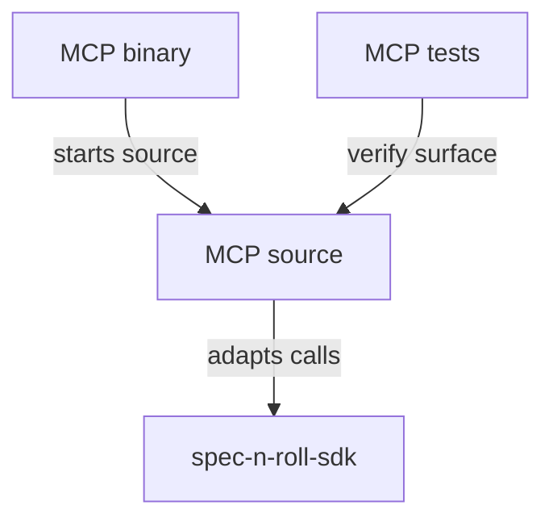

# spec-n-roll-mcp - package root

This package owns the MCP executable surface for spec-n-roll. It adapts protocol-level requests into package behavior while remaining installable with project-local tooling.

## Structure

## Conventions

### Protocol boundary

Keep MCP protocol concerns in this package. Shared command or domain behavior should move to `spec-n-roll-sdk` rather than being duplicated by the MCP executable.

### Composition

Composition classes in this package should be the place that binds MCP CLI adapters, command runners, protocol adapters, and logger dependencies. Keep those bindings out of SDK-facing behavior so MCP transport setup remains local to this package.
