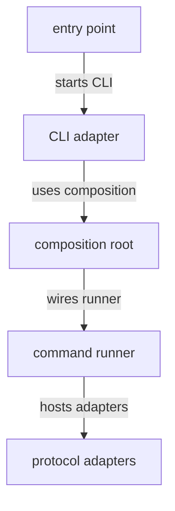

# MCP source - src

This directory contains the MCP process entry point, CLI adapter, command runner boundary, and dependency composition for future protocol adapters. The source should translate process and protocol concerns into SDK-facing calls.

## Structure

## Conventions

### Adapter shape

Keep command runner and protocol integration behind MCP adapter boundaries. Do not let MCP transport details leak into SDK business abstractions.

### Imports

Use the package-local `#mcp/*` import alias for source imports. Add new files for distinct adapter or composition responsibilities rather than expanding entry-point code.
