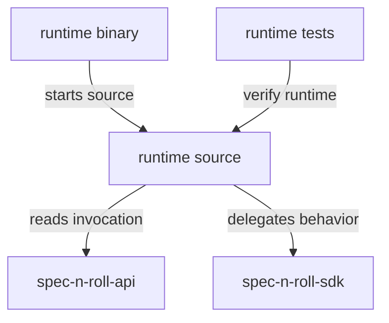

# spec-n-roll-runtime - package root

This package owns the child-process runtime executable that receives dispatcher context and performs command behavior. It is designed to run beside project-local tooling while sharing invocation contracts with globally installed dispatchers.

## Structure

## Conventions

### Invocation boundary

Runtime processes should receive dispatcher context through `RuntimeInvocation` JSON on stdin. Keep parsing, validation, user-facing output, and command behavior separated behind explicit interfaces.

### Runtime behavior

Use SDK abstractions for reusable business rules when behavior grows beyond runtime orchestration. Runtime logs should describe invocation parsing and selected command behavior, while stdout and stderr remain behind the runtime output boundary.
