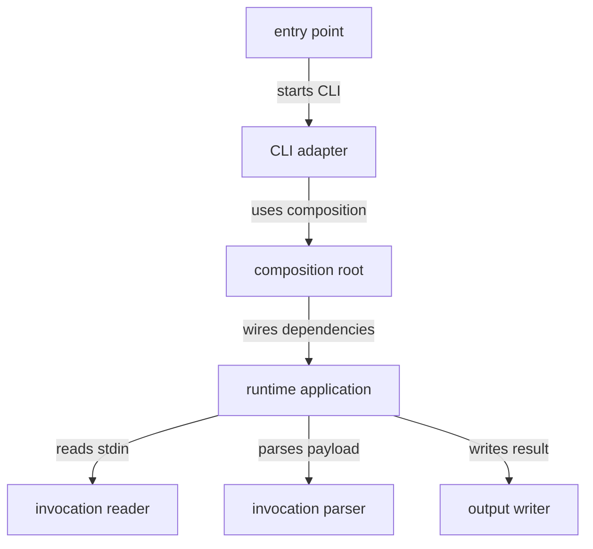

# Runtime source - src

This directory contains the runtime entry point, CLI adapter, composition root, invocation reader and parser, runtime application, and output boundary. Runtime source turns dispatcher-provided invocation data into command execution while keeping process I/O at the edges.

## Structure

## Conventions

### Process I/O

Keep stdin, stdout, and stderr access inside adapter classes. Application code should depend on invocation-reader and output-writer interfaces rather than Node process globals.

### Payload handling

Parse the API package payload shape before executing command behavior. Runtime logs from this source directory should identify the invocation context, parse result, and selected command path.
