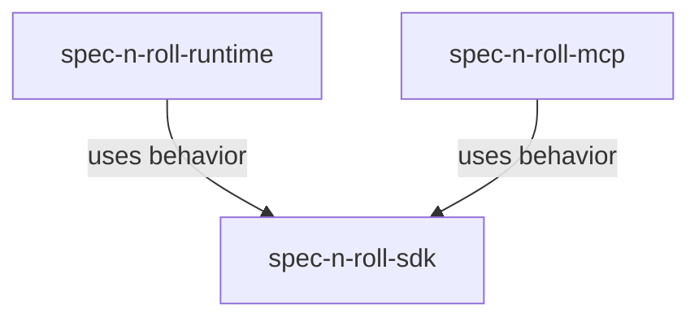

# spec-n-roll-sdk - package root

This package owns reusable application and business behavior for the current spec-n-roll implementation. Executable packages should depend on this package for shared rules instead of reimplementing them in dispatcher, runtime, or MCP layers.

## Structure

## Conventions

### Business ownership

Place transport-independent behavior here when it is shared by more than one executable surface or clearly belongs to the application model. Process, filesystem, and vendor details should enter this package through SDK-owned ports that executable packages implement.

### Public API

Expose only deliberate SDK contracts from the package entry point. Avoid broad convenience exports that make executable packages depend on internal representation.
