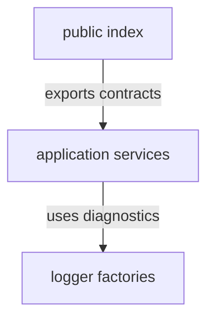

# SDK source - src

This directory contains business-level abstractions that are independent of executable transport concerns. It is the place for reusable application behavior, local interfaces, and implementations that can support runtime and MCP surfaces without knowing about either transport.

## Structure

## Conventions

### Transport independence

Keep dispatcher, runtime, MCP, and CLI-specific concerns out of SDK source. Model dependencies as interfaces and inject concrete adapters from executable packages or composition roots.

### API growth

Add new SDK abstractions only when runtime or MCP consumers need shared behavior with a clear owner in this source directory. Export contracts that describe the application capability, not the service internals that currently implement it.
