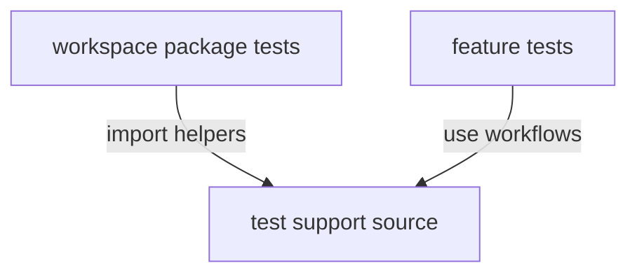

# spec-n-roll-test - package root

This package owns reusable test support, project-level executable test workflows, and shared fixtures for workspace packages. It lets package tests share setup and command execution helpers without duplicating test infrastructure.

## Structure

## Conventions

### Test support ownership

Keep reusable fixtures, assertions, command runners, and test workflow helpers in this package. Package-specific assertions should stay with the package under test unless they are genuinely reusable.

### Executable tests

Treat Cucumber and CLI support as test infrastructure, not application runtime behavior. Keep process execution behind command-runner abstractions so tests can choose the appropriate runner.
