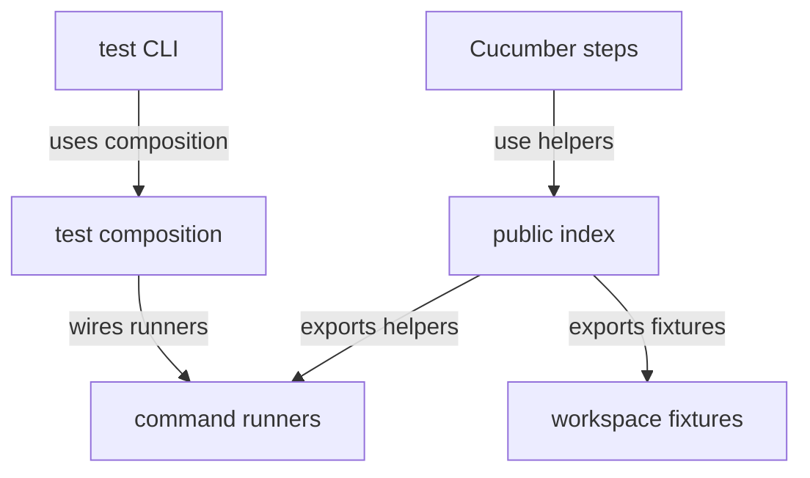

# Test support source - src

This directory contains reusable fixtures, command runners, CLI composition, Cucumber step support, and workspace-level test helpers. The source supports tests across packages while keeping test execution details separate from production code.

## Structure

## Conventions

### Reusable helpers

Keep helpers focused on test concerns that are shared across packages. Avoid moving package-specific setup here unless another package can use it without inheriting unrelated assumptions.

### Process execution

Model executable test workflows through command-runner interfaces and factories. Keep direct process work inside runner implementations so higher-level tests remain readable.
