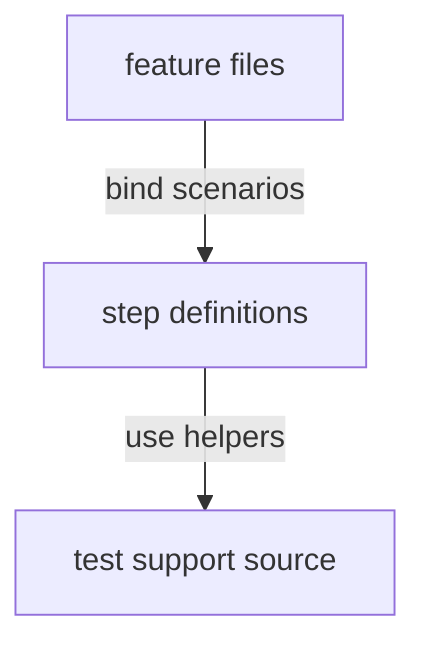

# Cucumber step support - cucumber

This directory contains Cucumber step definitions used by workspace-level feature tests. Step code should translate Gherkin scenarios into test-support workflows while keeping assertions and process details behind reusable helpers when they grow beyond simple stubs.

## Structure

## Conventions

### Step definitions

Keep step text stable and behavior-focused. Move shared setup, command execution, and assertion helpers to the parent test-support source instead of duplicating workflow code in individual step files.

### State handling

Keep scenario state tied to the Cucumber workflow being exercised. Prefer small local state objects or test-support helpers when steps need more than a simple temporary value.
