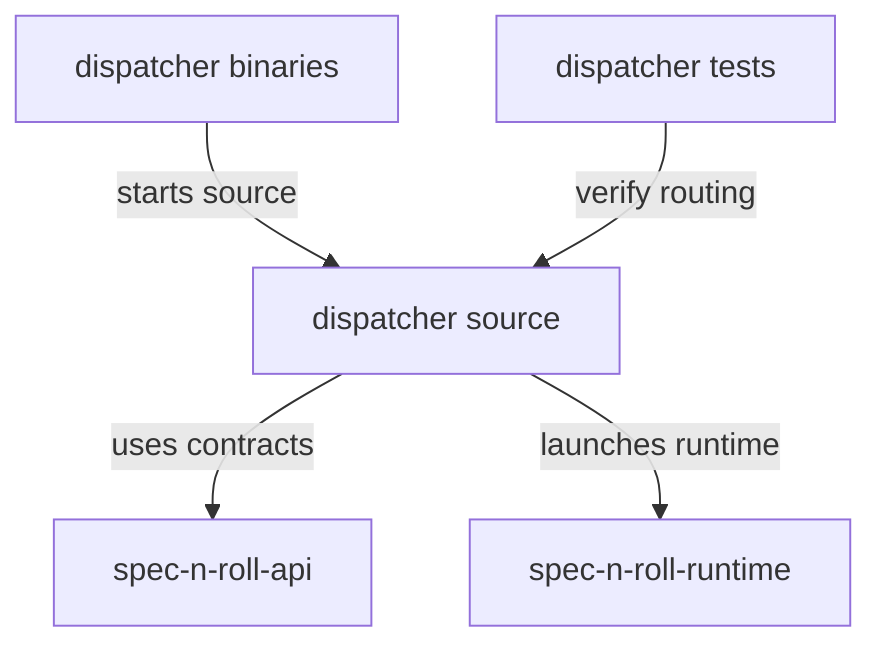

# spec-n-roll - package root

This package owns the public `spec-n-roll` and `snr` dispatcher executables. It resolves project context, interprets dispatcher-only routing options, and delegates command execution to the appropriate local or packaged runtime.

## Structure

## Conventions

### Dispatcher responsibility

Keep this package focused on process routing, project-root discovery, runtime-target resolution, and child-process execution. Command business behavior belongs behind runtime or SDK boundaries.

### Runtime delegation

Dispatcher code should communicate with runtimes through `spec-n-roll-api` contracts. Routing logs in this package should capture the selected runtime target, project root, working directory, and install-source metadata that explain why a process was launched.
