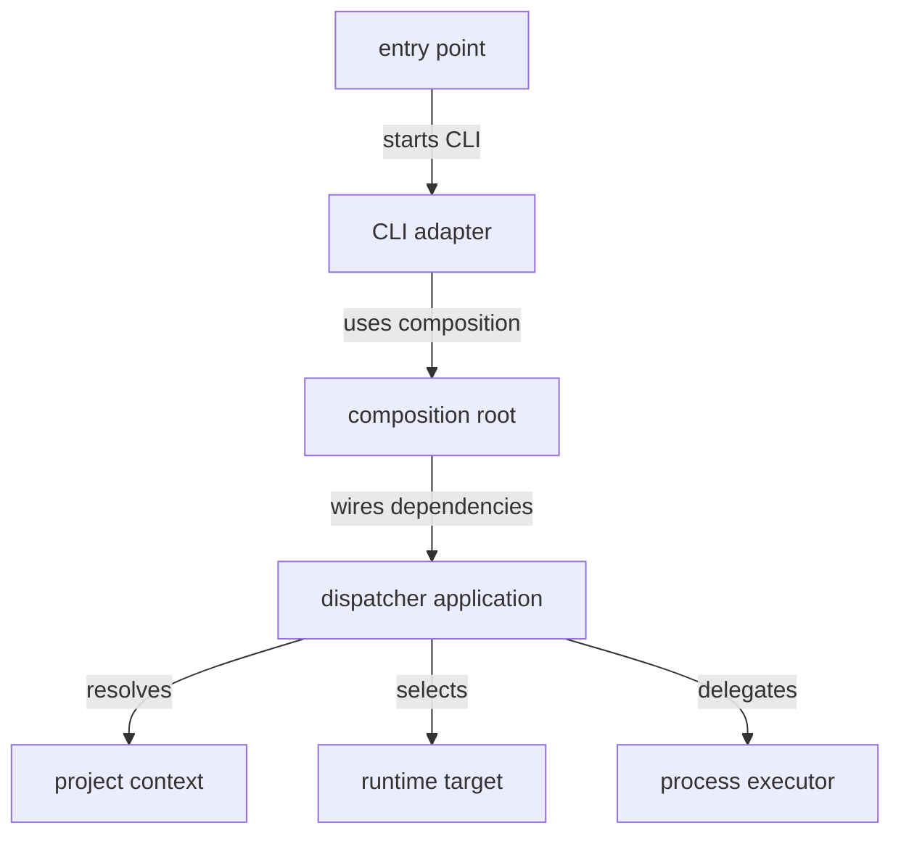

# Dispatcher source - src

This directory contains the dispatcher entry point, composition root, command parsing, project discovery, runtime selection, and runtime process execution abstractions. The code keeps command routing separate from the runtime behavior that eventually handles a request.

## Structure

## Conventions

### Boundary shape

Model dispatcher decisions as dispatcher boundary types for routing requests, project context, runtime targets, and process execution. Keep filesystem, process environment, metadata reading, and child-process launch details behind adapters used by the dispatcher application.

### Imports

Use the package-local `#dispatcher/*` import alias for source imports. Use `spec-n-roll-api` for shared payloads and path contracts instead of redefining boundary types locally.
